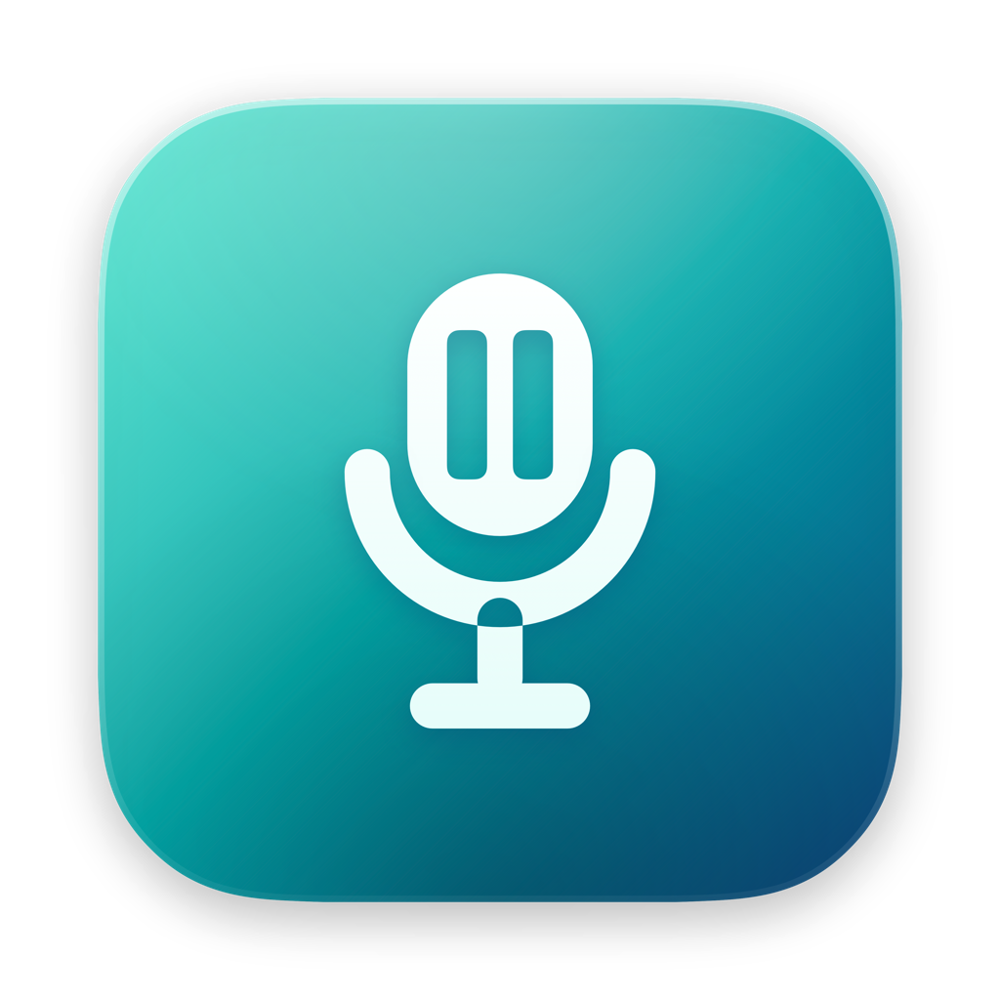

<p align="center">
  
</p>

<h1 align="center">Mic Pause</h1>
<p align="center"><strong>Quiet music. Clear conversations.</strong></p>
<p align="center">A native Mac menu-bar app that pauses Apple Music when your microphone is in use<br>and brings it back when you’re done.</p>
<p align="center">
  <a href="https://github.com/dp466/MusicMicPause/releases">Download</a> ·
  <a href="#getting-started">Getting started</a> ·
  <a href="#privacy">Privacy</a> ·
  <a href="https://github.com/dp466/MusicMicPause/issues">Report an issue</a>
</p>
<p align="center">macOS 14+ · Apple silicon & Intel · Apple Music</p>

<p align="center">
  
</p>

## Let your microphone handle the pause

Start a call, record a voice note, or use dictation. Mic Pause watches microphone activity and pauses Apple Music if it is playing. When the microphone becomes inactive, it resumes only if Mic Pause initiated the pause and automatic resume is enabled.

- **Stay in control.** Music you already paused stays paused. Manually resume during a microphone session and Mic Pause leaves playback alone for that session.
- **Choose the timing.** Resume immediately, or wait 1, 2, or 5 seconds. Turn automatic resume off whenever you prefer.
- **Choose your sources.** See the apps currently using the microphone and ignore individual sources. Known always-on listeners are ignored by default; Dictation and Siri still trigger a pause unless you explicitly ignore them.
- **Keep it close.** Left-click the menu-bar icon for the dashboard. Right-click for monitoring, Settings, and Quit.
- **Ready at login.** Launch at Login is enabled on first launch and can be switched off in Settings.

## Getting started

1. Download the `.dmg` from [Releases](https://github.com/dp466/MusicMicPause/releases).
2. Open the disk image and drag **Mic Pause** into **Applications**. Eject the disk image.
3. Open Mic Pause from Applications, then click its microphone icon in the menu bar.
4. Allow Mic Pause to control Apple Music when macOS asks. Start playing music and use your microphone.

**Preview downloads:** the initial preview is development-signed and **not notarized by Apple**. macOS may block it. If you trust this download, review **System Settings → Privacy & Security → Open Anyway** after attempting to open it. A preview does not offer the same installation experience as a Developer ID signed, notarized release. Read the signing status in each release before installing.

Each release includes a SHA-256 checksum. From the folder containing the download and its `.sha256` file:

```sh
shasum -a 256 -c Mic-Pause-1.0-preview.1-universal.sha256
```

## Make it yours

<p align="center">
  
</p>

The default resume delay is two seconds. Settings also contains microphone source controls, Apple Music permission checks, and the privacy policy.

Mic Pause controls the **Music app on your Mac**. It does not control Spotify, browser players, or system volume. An Apple Music subscription is not required for local music playback.

## Privacy

Mic Pause reads Core Audio activity metadata: whether an input is active and which capture processes macOS reports. It **does not open an audio stream, record audio, or analyze conversations**.

There are no accounts, analytics, ads, or network requests in the app. Preferences stay on your Mac. Mic Pause requests Automation permission to control Music; it does not require Accessibility or microphone-recording permission.

See the [privacy policy](docs/privacy.html) and the [included privacy manifest](MicPause/PrivacyInfo.xcprivacy).

## Troubleshooting

| What you see | What to check |
| --- | --- |
| Music does not pause | Enable monitoring. In Settings, check Apple Music permission. If denied, allow Music under **System Settings → Privacy & Security → Automation → Mic Pause**. |
| Music does not resume | Enable automatic resume and wait for the selected delay. Music must have been paused by Mic Pause. A still-active capture source can keep it paused. |
| The microphone seems permanently active | Review **Settings → Microphone Sources**. Some apps or drivers keep an input open between calls. Ignore a source only when you want its microphone use to leave Music playing. |
| The icon is missing | Mic Pause has no Dock icon. Check the menu bar and any menu-bar hiding utility. |
| Launch at Login needs approval | Review **System Settings → General → Login Items**. Install the app in Applications before enabling it. |

Detection depends on the activity information supplied by macOS and audio drivers. Mic Pause checks the system-wide capture list every second, including apps using a non-default microphone. When process attribution is unavailable, it falls back to the default input’s activity flag. A manual resume-and-pause sequence shorter than the player polling interval may not be observable.

Please [open an issue](https://github.com/dp466/MusicMicPause/issues) with your macOS version, app version, microphone, and steps to reproduce the problem.

## Build from source

Use Xcode 26 or later with the macOS 26 SDK (the current checkout is verified with Xcode 27), and [XcodeGen](https://github.com/yonaskolb/XcodeGen). The app deploys to macOS 14 and uses newer visual effects only where supported.

```sh
brew install xcodegen
git clone https://github.com/dp466/MusicMicPause.git
cd MusicMicPause
xcodegen generate
./script/build_and_run.sh --verify
```

Select your signing team in Xcode when building on another account. The build script defaults to `/Applications/Xcode.app`; set `DEVELOPER_DIR` to use another installation. Signed Debug builds install into `/Applications/MicPause.app` and replace an existing development copy.

```sh
./script/test.sh                    # App unit tests
./script/validate_release.sh        # App + website preflight
```

[Development notes](docs/DEVELOPMENT.md) cover the project layout, screenshots, and icon generation. [Release instructions](docs/RELEASING.md) cover universal builds, [SwiftyDMG](https://github.com/chocoford/SwiftyDMG), signing, notarization, and GitHub assets.

---

Created by [Dilan Paradis](https://github.com/dp466). Mic Pause is an independent utility and is not affiliated with Apple.
