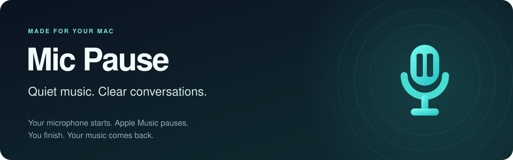
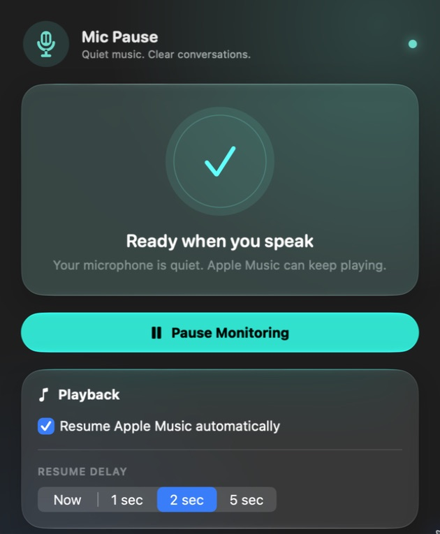
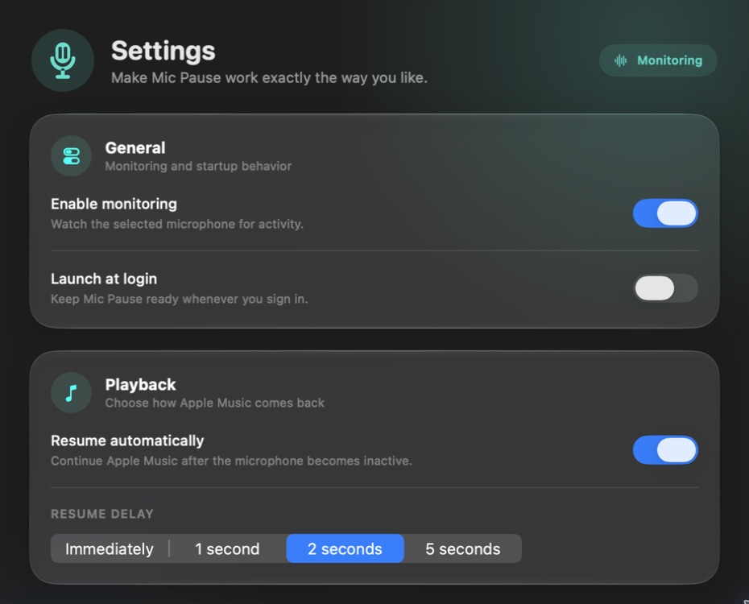

<p align="center">
  
</p>

<p align="center">
  <strong>macOS 14+</strong> &nbsp;·&nbsp; Apple silicon &amp; Intel &nbsp;·&nbsp; Built with Swift &amp; SwiftUI
</p>
<p align="center">
  <a href="https://github.com/dp466/MusicMicPause/releases"><strong>Download the preview →</strong></a> &nbsp;·&nbsp;
  <a href="#getting-started">Get started</a> &nbsp;·&nbsp;
  <a href="#privacy">Privacy</a> &nbsp;·&nbsp;
  <a href="https://github.com/dp466/MusicMicPause/issues">Report an issue</a>
</p>

## Music that makes room for you

Start a call, record a voice note, or use dictation. **Mic Pause automatically pauses Apple Music while your microphone is active**, then resumes it when you’re done. It lives in your menu bar, ready whenever you need it.

| Your music, your control | Built for everyday use |
| --- | --- |
| **Resume on your terms.** Choose immediately, 1, 2, or 5 seconds—or disable automatic resume. | **Choose what counts.** Review active microphone sources and ignore individual apps. |
| **Manual pauses stay paused.** Music resumes only if Mic Pause initiated the pause. | **One click away.** Open the dashboard from the menu bar; right-click for quick actions. |
| **Override any session.** Manually resume Music and Mic Pause leaves playback alone for that microphone session. | **Ready at login.** Launch at Login is enabled on first launch and can be switched off. |

## A small app, with the controls you need

<table>
  <tr>
    <th>See what’s happening</th>
    <th>Set your own rhythm</th>
  </tr>
  <tr>
    <td align="center" valign="top"></td>
    <td align="center" valign="top"></td>
  </tr>
  <tr>
    <td>Microphone status and playback controls at a glance.</td>
    <td>Monitoring, startup, and playback preferences in one place.</td>
  </tr>
</table>

<sub>Captured from the app’s native views on macOS 27. Images focus on the primary controls; additional settings are available by scrolling. Appearance varies with macOS.</sub>

## Getting started

1. **[Download the DMG](https://github.com/dp466/MusicMicPause/releases)** for the latest preview.
2. Drag **Mic Pause** into **Applications**, then eject the disk image.
3. Open Mic Pause and click its microphone icon in the menu bar.
4. Allow it to control **Music** when macOS asks. Play some music, then start using your microphone.

The default resume delay is **two seconds**. Mic Pause controls the **Music app on your Mac**; Spotify, browser players, and system volume are outside its scope. Local music playback does not require an Apple Music subscription.

> **Preview signing:** the current preview is development-signed and **not notarized by Apple**. macOS may block it. Read the release’s installation notes before installing. If you trust the download, macOS provides **System Settings → Privacy & Security → Open Anyway** after an attempted launch.

<details>
<summary>Verify your download</summary>

Each release includes a SHA-256 checksum. Put the DMG and its `.sha256` file in the same folder, then run:

```sh
shasum -a 256 -c Mic-Pause-1.0-preview.1-universal.sha256
```

Use the filename supplied with your release. A matching checksum confirms the file matches the published download; it does not replace code signing or notarization.

</details>

## Privacy

**No audio recordings. No accounts. No analytics.**

Mic Pause reads Core Audio activity metadata to learn whether a microphone is active and which capture processes macOS reports. It does not open an audio stream or analyze your conversations. The app makes no network requests, and preferences stay on your Mac.

It requests **Automation permission for Music**. It does not require Accessibility or microphone-recording permission.

[Read the privacy policy](docs/privacy.html) · [Inspect the privacy manifest](MicPause/PrivacyInfo.xcprivacy)

## Questions & troubleshooting

<details>
<summary><strong>Music doesn’t pause or resume</strong></summary>

- Enable monitoring and check Apple Music permission in Settings. If denied, review **System Settings → Privacy & Security → Automation → Mic Pause**.
- For resume, enable automatic resume and wait for the selected delay. Mic Pause must have initiated the pause, and the microphone must be inactive.
- A capture source that stays active can keep Music paused. Review **Settings → Microphone Sources**.

</details>

<details>
<summary><strong>The microphone appears to be always active</strong></summary>

Some apps and drivers keep an input open between calls. Review **Settings → Microphone Sources** and ignore a source only when you want its microphone use to leave Music playing.

Known background listeners are ignored by default. Dictation and Siri still trigger a pause unless you explicitly ignore them.

Detection depends on macOS and audio-driver activity reports. The app checks system-wide capture processes every second, including those using a non-default microphone. When attribution is unavailable, it falls back to the default input’s activity flag. Very brief manual playback changes can occur between polling intervals.

</details>

<details>
<summary><strong>I can’t find the app, or Launch at Login needs approval</strong></summary>

Mic Pause has no Dock icon. Check the menu bar and any menu-bar hiding utility. For startup approval, review **System Settings → General → Login Items**. Install the app in Applications before enabling Launch at Login.

</details>

Still stuck? [Open an issue](https://github.com/dp466/MusicMicPause/issues) with your macOS version, app version, microphone, and steps to reproduce.

## Build from source

Use **Xcode 26+ with the macOS 26 SDK or newer** and [XcodeGen](https://github.com/yonaskolb/XcodeGen). This checkout is verified with Xcode 27; the app runs on macOS 14+ and adopts newer visual effects where supported.

```sh
brew install xcodegen
git clone https://github.com/dp466/MusicMicPause.git
cd MusicMicPause
xcodegen generate
./script/build_and_run.sh --verify
```

Select your signing team in Xcode. The script defaults to `/Applications/Xcode.app`; set `DEVELOPER_DIR` to choose another installation. Signed Debug builds install into `/Applications/MicPause.app`, replacing an existing development copy.

```sh
./script/test.sh              # Native app tests
./script/validate_release.sh  # App and website preflight
```

[Development guide](docs/DEVELOPMENT.md) · [Release & SwiftyDMG packaging guide](docs/RELEASING.md)

---

Made by [Dilan Paradis](https://github.com/dp466). Mic Pause is an independent utility and is not affiliated with Apple.
